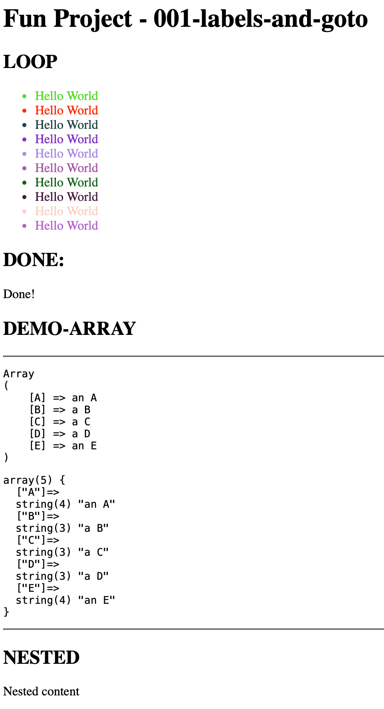

# 001 - Labels and Goto

> **Fun Project - Labels and Goto**
> A celebration of PHP's most misunderstood control structure



## Overview

This project demonstrates the elegant power of `goto` and labels in PHP, combined with a minimal, functional approach to HTML generation. It's a showcase of how simplicity and directness can lead to remarkably clean code.

## Features

### 🎯 Goto-Based Loop Control

Instead of verbose `do-while` constructs, we use the elegant combination of labels and `goto`:

```php
$i=0; hello_world_loop: {
  h('li style="color: rgb('.rand(0,255).','.rand(0,255).','.rand(0,255).');"');
    c('Hello World');
  h('/li');
} if (++$i<10) goto hello_world_loop;
```

**Benefits:**
- **Ultra-compact syntax** - Everything on minimal lines
- **Crystal-clear flow** - The label name describes exactly what the loop does
- **Zero overhead** - No hidden iteration mechanics, just pure jumps
- **Visual clarity** - The block structure is explicit and readable

### 🏷️ Minimalist HTML Generation

Five powerful helper functions that spell out our philosophy:

```php
// (h)onest (p)HP (c)ode (d)oesn't (l)ie
function h($tag)  {echo '<'.$tag.'>';}
function p($arr)  {echo '<pre>'; print_r($arr); echo '</pre>';}
function c($ctn)  {echo $ctn; }
function d($var)  {echo '<pre>'; var_dump($var); echo '</pre>';}
function l($m=1)  {static $l=1; return $m ? $l++ : $l--; }
```

**Yes, the function names literally spell "h-p-c-d-l" - *Honest PHP Code Doesn't Lie*.**

**Benefits:**
- **Single character names** - Maximum efficiency in typing
- **No abstraction layers** - Direct output, no buffers, no complexity
- **Composable** - Mix and match however you need
- **Self-documenting** - Each function does exactly what its name suggests
- **Poetic justice** - The code embodies its own philosophy

### 📊 Intelligent Level Management

The `l()` function provides stateful, bidirectional counting:

```php
function l($m=1)  {static $l=1; return $m ? $l++ : $l--; }

h('h'.$l=l()); c($title); h('/h'.$l);     // Creates <h1>
h('h'.$l=l()); c('Section'); h('/h'.$l);  // Creates <h2>
l(0);                                      // Step back to previous level
```

**Benefits:**
- **Automatic hierarchy** - No manual level tracking needed
- **Bidirectional control** - Count up or down as needed
- **Persistent state** - Levels maintained across calls using `static`
- **Inline assignment** - Capture and use the level in one expression
- **Perfect for semantic HTML** - Natural heading hierarchy management

### 🎨 Dynamic Styling

Inline random color generation adds visual variety:

```php
h('li style="color: rgb('.rand(0,255).','.rand(0,255).','.rand(0,255).');"');
```

**Benefits:**
- **No CSS files** - Everything in one place
- **Instant feedback** - Different colors on every page load
- **RGB power** - 16.7 million color possibilities
- **Zero dependencies** - Just PHP's built-in `rand()`

## Code Philosophy

This project embraces:

1. **Directness over abstraction** - Why wrap what's already simple?
2. **Explicitness over magic** - See exactly what's happening
3. **Function over form** - It works, beautifully
4. **Joy over dogma** - Code should be fun!

## Structure

The code follows a natural document flow with clear visual indentation that mirrors the HTML structure:

```php
h('html lang="de"');
  h('head');
    h('title');
      c($title);
    h('/title');
  h('/head');
  h('body');
    // Content here
  h('/body');
h('/html');
```

## Running the Project

Simply open `index.php` in your browser through your PHP server. Watch as:
- 10 colorful "Hello World" items appear
- Each in a randomly generated RGB color
- With proper semantic heading hierarchy
- And debug output showing data structures

## What Makes This "Forbidden"?

- **`goto` statements** - The most misunderstood feature in PHP
- **Single-letter functions** - Maximum brevity
- **Static variables** - Persistent state without classes
- **Inline everything** - Assignments, function calls, concatenation
- **No separation of concerns** - HTML, logic, and data together
- **Global state** - And proud of it!

## Conclusion

This isn't just code - it's a statement. A reminder that "best practices" are guidelines, not laws. That sometimes the "wrong" way is the most delightful way. That PHP's forbidden features exist for a reason: they're powerful when wielded with intention.

Welcome to forbidden PHP. Where goto isn't a mistake - it's a feature. 🚀
